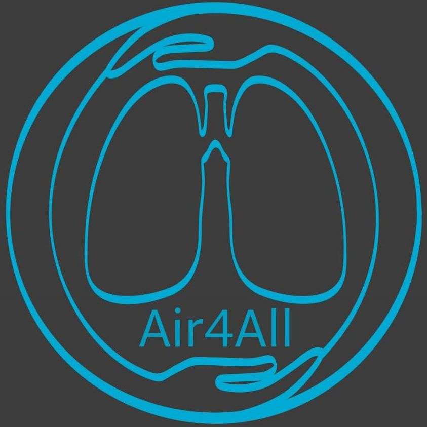

# Ventilator Control Project

Software for control a GUI  panel visualisation  for Open Source ventilator

# Learn:
## Usefull Simulators
1. [Xlung Demo](https://simulation.xlung.net/xlung/demo)

## Other Infos
1. [An introduction to the ventilator waveform](https://derangedphysiology.com/main/cicm-primary-exam/required-reading/respiratory-system/Chapter%20551/introduction-ventilator-waveform)

## Youtube Information Videos
1. Introduction to Mechanical Ventilation Maquet SERVO-i

2. Overview of the Servo 900c Pneumatic Unit

## Other local Projects
1. [Offset Ventilator](https://docs.google.com/document/d/1ly9UT5F0uIXBLi50U1m13eHRYHaN_rhwDnVimA0W1iI)
2. [Project 3 - Ambu bag based](https://www.dropbox.com/home/Mechanics/Project%203%20-%20Ambu%20bag%20based%20-%20on%20hold)

---
> Copyright © 2019-2020 Bernardo Carvalho, All rights reserved.

> "Air for All Portugal is free software: you can redistribute it and/or modify
it under the terms of the GNU General Public License as published by
the Free Software Foundation, either version 3 of the License, or
(at your option) any later version.

> "Air for All Portugal  is distributed in the hope that it will be useful,
but WITHOUT ANY WARRANTY; without even the implied warranty of
MERCHANTABILITY or FITNESS FOR A PARTICULAR PURPOSE.  See the
GNU General Public License for more details.

> You should have received a copy of the GNU General Public License
along with "Air for All Portugal". If not, see <http://www.gnu.org/licenses/>.
